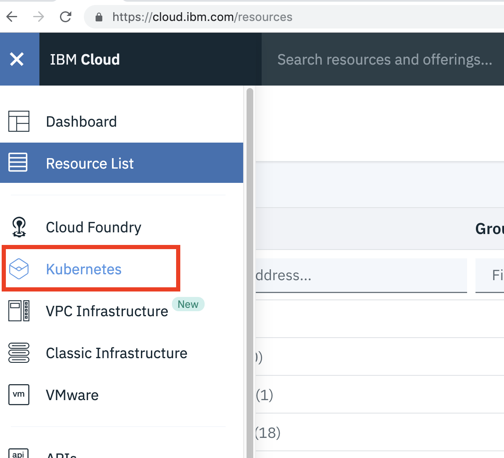

# Cloud Workshop 20 June


## 0. Register on IBM Cloud

https://ibm.biz/BdzPaf


After successful registration Login into your account. 


## 1. Convert the IBM Cloud Lite account to Trial account

You will be provided with PROMO Code. 
Account -- Apply Promo Code

For instructions on how to apply the codes, 
review this page
[IBM Cloud Sign up and PROMO Code](https://cloud.ibm.com/docs/account?topic=account-codes#codes)

Or Follow instruction in Lab

## 2. Provision a Kubernetes Cluster on IBM Cloud

From Dashboard menu, select Kubernetes.



After that click on "Create Cluster", you will be asked following details to enter.
a - Select Free Cluster
b - Give a cluster name
c - Select Geography as North America and Select Dallas with default resource group
     

     
Once the cluster is provision, Cluster will be shown in Normal State. 
     
     


## 3. Access Kubernetes Cluster using Web Terminal

Once the cluster is provisioned, the kubernetes client CLI `kubectl` needs to be
configured to talk to the provisioned cluster.

This can also be done using your local desktops. You will have to install IBM Cloud Plugin Tools for doing that.

For this lab, you will be using Web Terminal, to work with your cluster. 

a. Access the Cluster, and go to Cluster details
   

b. Click on "Web terminal(beta) "
 

c. Web based terminal opens at the bottom of the browser.     
       
     
     
Once your open the Web based terminal, you are ready to deploy your first application, `guestbook`.


## 4. Deploy your application

In this part of the lab you will deploy an application called `guestbook`
that has already been built and uploaded to DockerHub under the name
`ibmcom/guestbook:v1`.

1. Start by running `guestbook`:

   ```$ kubectl create deployment guestbook --image=ibmcom/guestbook:v1```

   This action will take a bit of time. To check the status of the running application,
   you can use `$ kubectl get pods`.

   You should see output similar to the following:

   ```console
   $ kubectl get pods
   NAME                          READY     STATUS              RESTARTS   AGE
   guestbook-59bd679fdc-bxdg7    0/1       ContainerCreating   0          1m
   ```
   Eventually, the status should show up as `Running`.
   
   ```console
   $ kubectl get pods
   NAME                          READY     STATUS              RESTARTS   AGE
   guestbook-59bd679fdc-bxdg7    1/1       Running             0          1m
   ```
   
   The end result of the run command is not just the pod containing our application containers,
   but a Deployment resource that manages the lifecycle of those pods.
 
   
2. Once the status reads `Running`, we need to expose that deployment as a
   service so we can access it through the IP of the worker nodes.
   The `guestbook` application listens on port 3000.  Run:

   ```console
   $ kubectl expose deployment guestbook --type="NodePort" --port=3000
   service "guestbook" exposed
   ```

3. To find the port used on that worker node, examine your new service:

   ```console
   $ kubectl get service guestbook
   NAME        TYPE       CLUSTER-IP     EXTERNAL-IP   PORT(S)          AGE
   guestbook   NodePort   10.10.10.253   <none>        3000:31208/TCP   1m
   ```
   
   We can see that our `<nodeport>` is `31208`. We can see in the output the port mapping from 3000 inside 
   the pod exposed to the cluster on port 31208. This port in the 31000 range is automatically chosen, 
   and could be different for you.

4. `guestbook` is now running on your cluster, and exposed to the internet. We need to find out where it is accessible.
   The worker nodes running in the container service get external IP addresses.
   Run `$ ibmcloud cs workers <name-of-cluster>`, and note the public IP listed on the `<public-IP>` line.
   
   ```console
   $ ibmcloud cs workers mycluster
   OK
   ID                                                 Public IP        Private IP     Machine Type   State    Status   Zone    Version  
   kube-hou02-pa1e3ee39f549640aebea69a444f51fe55-w1   173.193.99.136   10.76.194.30   free           normal   Ready    hou02   1.5.6_1500*
   ```
   
   We can see that our `<public-IP>` is `173.193.99.136`.
   
5. Now that you have both the address and the port, you can now access the application in the web browser
   at `<public-IP>:<nodeport>`. In the example case this is `173.193.99.136:31208`.
   
   
    
     
     
Congratulations, you've now deployed an application to Kubernetes!

## 5. Scale your application,
Kubernetes Cluster has many capabilities, you will now explore the scaling. 

In this section, you'll learn how to update the number of instances a deployment has, and 
how to safely roll out an update of your application on Kubernetes.

A replica is a copy of a pod that contains a running service. 
By having multiple replicas of a pod, you can ensure your deployment has the available resources to 
handle increasing load on your application.

1.	kubectl provides a scale subcommand to change the size of an existing deployment. 
Let's increase our capacity from a single running instance of guestbook up to 10 instances.

   ```console
   $ kubectl scale --replicas=10 deployment guestbook
   deployment "guestbook" scaled
   ```


2. Kubernetes will now try to match the desired state of 10 replicas by starting 9 new pods with the same configuration 
as the first.

   ```console
   $ kubectl rollout status deployment guestbook
	Waiting for rollout to finish: 1 of 10 updated replicas are available...
	Waiting for rollout to finish: 2 of 10 updated replicas are available...
	Waiting for rollout to finish: 3 of 10 updated replicas are available...
	Waiting for rollout to finish: 4 of 10 updated replicas are available...
	Waiting for rollout to finish: 5 of 10 updated replicas are available...
	Waiting for rollout to finish: 6 of 10 updated replicas are available...
	Waiting for rollout to finish: 7 of 10 updated replicas are available...
	Waiting for rollout to finish: 8 of 10 updated replicas are available...
	Waiting for rollout to finish: 9 of 10 updated replicas are available...
	deployment "guestbook" successfully rolled out
   ```


The rollout might occur so quickly that the above messages might not display
3.	Once the rollout has finished, ensure your pods are running

```console

$ kubectl get pods
NAME                        READY     STATUS    RESTARTS   AGE
guestbook-562211614-1tqm7   1/1       Running   0          1d
guestbook-562211614-1zqn4   1/1       Running   0          2m
guestbook-562211614-5htdz   1/1       Running   0          2m
guestbook-562211614-6h04h   1/1       Running   0          2m
guestbook-562211614-ds9hb   1/1       Running   0          2m
guestbook-562211614-nb5qp   1/1       Running   0          2m
guestbook-562211614-vtfp2   1/1       Running   0          2m
guestbook-562211614-vz5qw   1/1       Running   0          2m
guestbook-562211614-zksw3   1/1       Running   0          2m
guestbook-562211614-zsp0j   1/1       Running   0          2m


```

You should see output listing 10 replicas of your deployment
      


When you're all done, you can remove the deployment
and thus stop taking the course.

  1. To remove the deployment, use `$ kubectl delete deployment guestbook`.

  2. To remove the service, use `$ kubectl delete service guestbook`.

