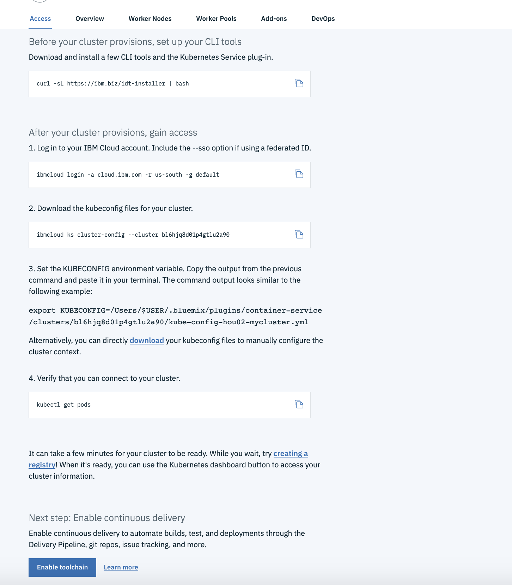
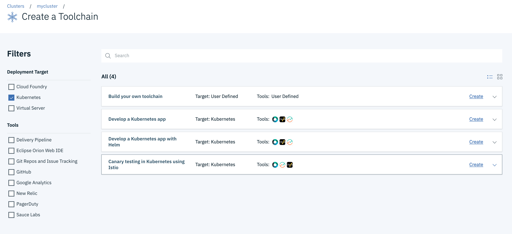
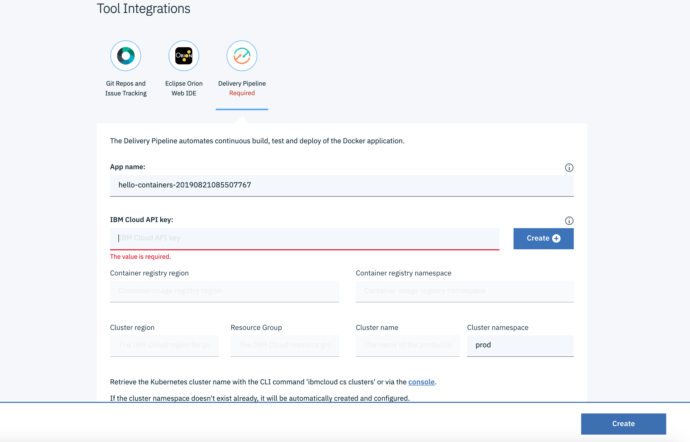
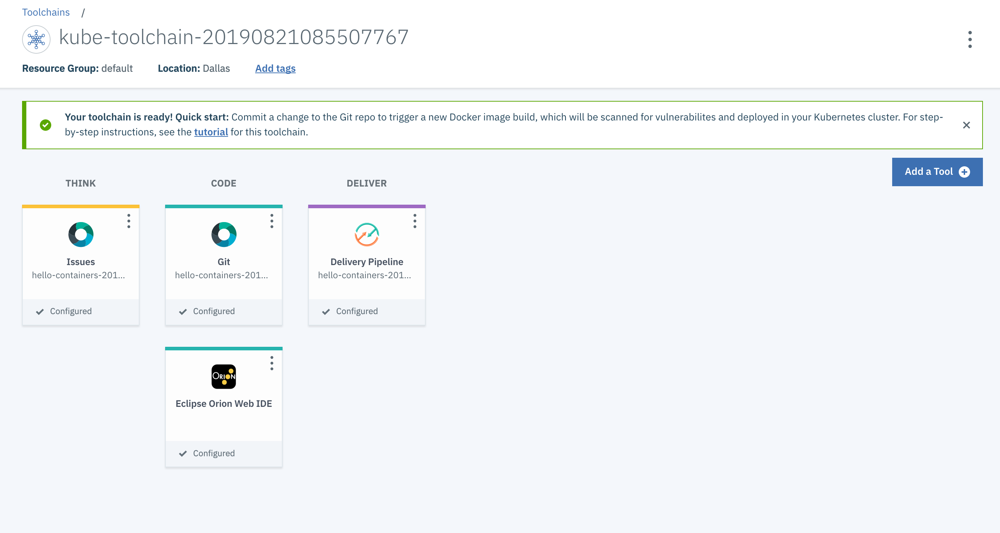
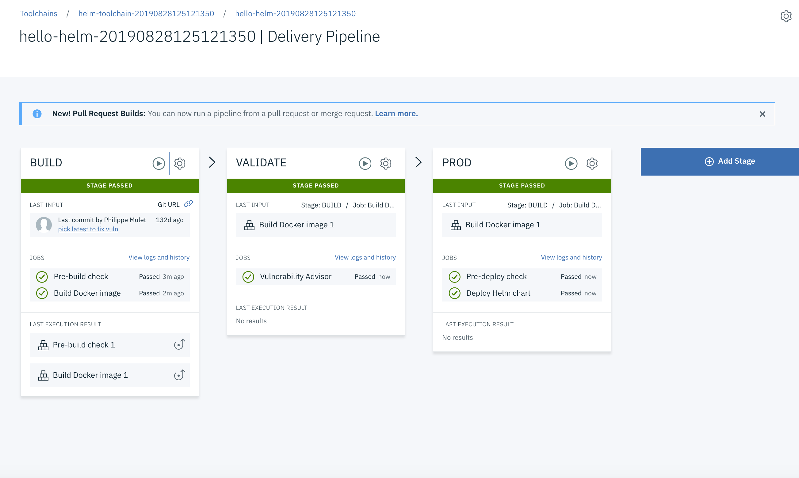
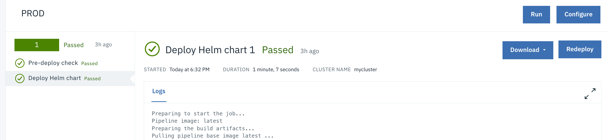
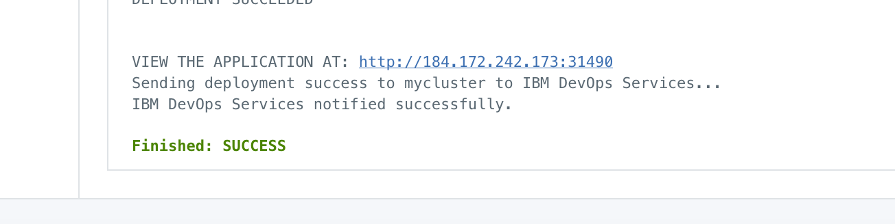

## Develop a Kubernetes app with Helm using Continuous Delivery & Continuous Integration

Steps:

1. Create a CONTINUOUS DELIVERY service in IBM Cloud.

2. Click on **ACCESS** in the Kubernetes cluster page and click on **Enable Toolchain** 

3. Click on **Create** in the **Develop a Kubernetes app with Helm** option

4. In the redirected page, scroll down and, click CREATE next to **IBM Cloud API Key** Wait for the values to get auto populated and click on **CREATE** the toolchain.

5. Click Delivery Pipeline and you can see the BUILD, VALIDATE and PROD stage(as shown below).

6. Click on **Deploy Helm Chart** within PROD stage to see the logs.

7. Scroll down and VIEW the application by clicking in the URL mentioned near **VIEW THE APPLICATION AT**

## Task 2: Update the application and redeploy it

1. Click on Eclipse Web Orion IDE in the Toolchain

2. Open the app.js file and edit res.send response to any message.

`For eg: res.send('Welcome to IBM Cloud DevOps with Docker, Kubernetes and Helm Charts.I have learnt how to use the Continuous Delivery Service');`

3. In the left side, click on Git icon(second icon) and commit the changes by entering commit message in the right side.

4. Push the changes in the Outgoing branch.

5. Goto Delivery Pipeline to see the changes getting updated automatically and refresh the URL to see the updates you have made.

Congratulations you have completed the lab!